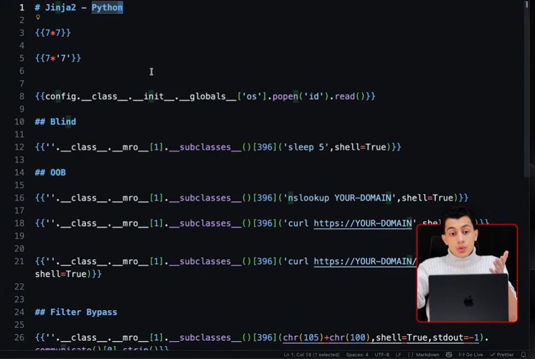
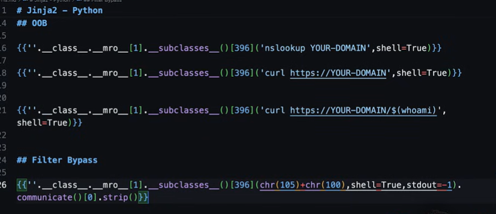
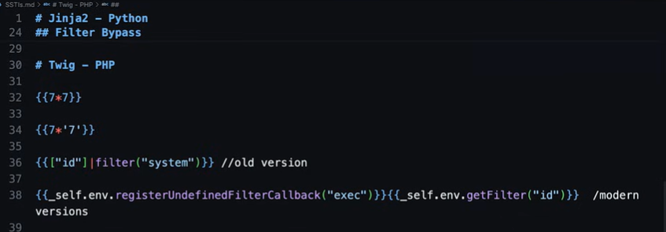
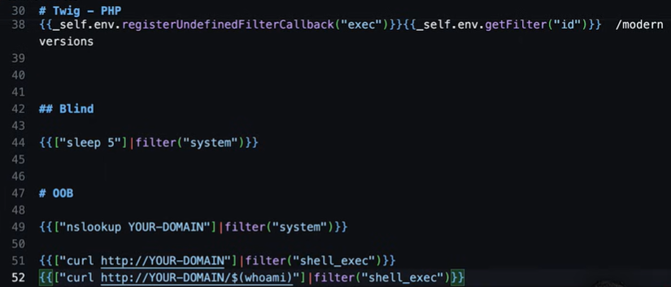
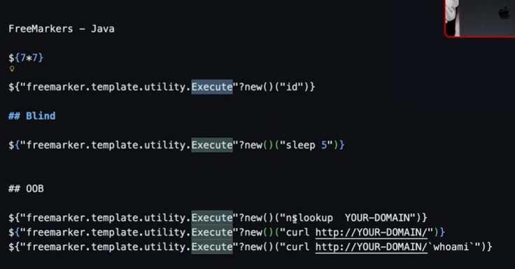
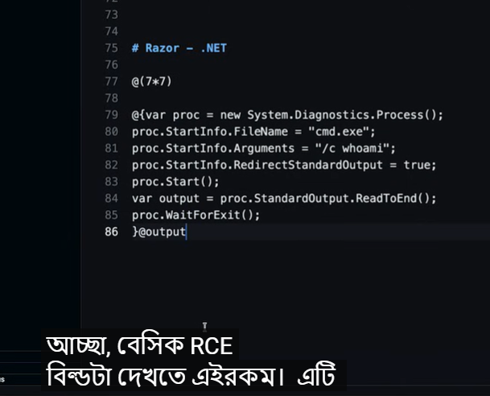

# SSTI

সবসময় জানা যায় না যে কোন ইঞ্জিনটি চলছে। এইখানেই পলিগ্লট পেলোডের ভূমিকা আসে। একটি পলিগ্লটকে একাধিক ইঞ্জিনে প্রতিক্রিয়া সক্রিয় করার জন্য ডিজাইন করা হয়। সুতরাং, সার্বজনীন পেলোডটি হবে অনেকটা এইরকম, আমি এখানে একটি শিরোনাম যোগ করছি, এবং এটি বহুভাষিক হবে। আর ঠিক এখানেই, সার্বজনীন বহুভাষীটি দেখতে অনেকটা এরকম হবে যে, এতে একাধিক ইঞ্জিনের সিনট্যাক্স উপাদান রয়েছে। বিভিন্ন ইঞ্জিন বিভিন্ন উপায়ে ত্রুটি দেখাবে, যা থেকে বোঝা যাবে কোনটি চালু আছে। মূলত, আপনার টেস্টিং পদ্ধতিটি এইরকম হওয়া উচিত। এক, সাধারণ গাণিতিক সূত্র ব্যবহার করে এসএসটিআই (SSTI) শনাক্ত করুন।
24:51
দুই, ইঞ্জিনের ধরনটি ফিঙ্গারপ্রিন্ট দিয়ে চিহ্নিত করুন। তৃতীয়ত, আপনাকে ইঞ্জিন-নির্দিষ্ট RCE পেলোড তৈরি করতে হবে। চতুর্থত, যদি আউটপুটটি অজানা থাকে, তবে সময়-ভিত্তিক বা সীমার বাইরের কৌশল ব্যবহার করুন। এবং সবশেষে, যদি ফিল্টারটি আপনার পেলোড ব্লক করে, তাহলে ইনক্লুডিং ক্যারেক্টার কনস্ট্রাকশন বা বিকল্প সিনট্যাক্স ব্যবহার করুন। TBL ম্যাপ এবং SSTI ম্যাপের মতো টুলগুলো প্রথম তিনটি ধাপ স্বয়ংক্রিয় করতে পারে, কিন্তু যখন আপনি ফিল্টার ব্যবহার করেন, যখন আপনি ব্লাইন্ড SSTI নিয়ে কাজ করেন, যখন আপনাকে নতুন কিছু ভাবতে হয়, তখনই
25:25
ম্যানুয়াল টেস্টিং এবং গভীর বোঝাপড়ার গুরুত্ব বোঝা যায়। এসএসটিআই শুধু সার্চ বক্সের মতো সুস্পষ্ট জায়গাতেই থাকে না। এইখানেই বেশিরভাগ মানুষ বিষয়টি এড়িয়ে যায়। এটা একাধিক জায়গায় আছে। প্রথমত, আমাদের কাছে পিডিএফ এবং ডকুমেন্ট জেনারেটর রয়েছে, যেগুলো ইনভয়েস, রিপোর্ট ও প্রাপক তৈরি করে। এগুলো টেমপ্লেট ব্যবহার করে। পিডিএফ-এ থাকা ফিল্ডগুলো পরীক্ষা করুন। এছাড়াও, আমাদের কাছে ইমেল টেমপ্লেট, কন্টাক্ট ফর্ম, নোটিফিকেশন ইমেল এবং পাসওয়ার্ড রিসেট মেসেজ রয়েছে। আপনার দেওয়া তথ্য যদি ইমেলের মূল অংশে থাকে, তাহলে SSTI পরীক্ষা করুন। এছাড়াও, ত্রুটির বার্তাগুলো।

অ্যাপ্লিকেশনে ত্রুটির পেজে ব্যবহারকারীর ইনপুট অন্তর্ভুক্ত থাকে। এখানে, এটি একটি টেমপ্লেট হতে পারে। আমাদের এপিআই রেসপন্স, REST এবং GraphQL এন্ডপয়েন্টগুলোতেও এটি রয়েছে, যেগুলো রেসপন্সগুলোকে ডায়নামিকভাবে ফরম্যাট করে। এছাড়াও, অ্যাডমিন প্যানেল, ড্যাশবোর্ড কাস্টমাইজেশন, রিপোর্ট বিল্ডার এবং নোটিফিকেশন সেটিংসে। এগুলো সোনার খনি, কারণ ডেভেলপাররা এই প্রেক্ষাপটগুলোতে আক্রমণের আশঙ্কা করেন না। এটাই হলো মৌলিক নীতি থেকে উদ্ভূত SSTI। এবং মূল শিক্ষাটি হলো, এটি কেবল পেলোড মুখস্থ করার বিষয় নয়, বরং টেমপ্লেট ইঞ্জিন কীভাবে

26:32কাজ করে, কেন এসএসটিআই (SSTI) ঘটে এবং বিপজ্জনক ফাংশনগুলোতে পৌঁছানোর জন্য প্রতিটি ভাষার অভ্যন্তরীণ কাঠামো কীভাবে ব্যবহার করতে হয়, তা বোঝা। যখন আপনি এই মৌলিক বিষয়গুলো বুঝতে পারবেন, তখন আপনি এমন ইঞ্জিনগুলোতেও SSTI ব্যবহার করতে পারবেন যা আগে কখনো দেখেননি। আপনি সেরা বোলতা কিনতে পারেন, আপনি একটি অননুসরণযোগ্য আবিষ্কারকে একটি গুরুত্বপূর্ণ RCE-তে পরিণত করতে পারেন। আর এটাই হলো টুল চালানো এবং প্রকৃত অর্থে একজন দক্ষ নিরাপত্তা গবেষক হওয়ার মধ্যে পার্থক্য।

_SSTI_From_Input_To_RCE_-_YouTube.png)

_SSTI_From_Input_To_RCE_-_YouTube.png)

_SSTI_From_Input_To_RCE_-_YouTube.png)

_SSTI_From_Input_To_RCE_-_YouTube.png)













**১. পিডিএফ এবং ডকুমেন্ট জেনারেটর (PDF & Document Generators)**অনেক আধুনিক ওয়েব অ্যাপ্লিকেশন ইউজারকে ইনভয়েস (Invoice), রিপোর্ট বা সার্টিফিকেট পিডিএফ আকারে ডাউনলোড করার সুবিধা দেয়। ব্যাকএন্ডে এই পিডিএফগুলো তৈরি করার জন্য **Wkhtmltopdf**, **Dompdf**, অথবা **TCPDF**-এর মতো লাইব্রেরি এবং টেমপ্লেট ইঞ্জিন ব্যবহার করা হয়।
• **ঝুঁকি কোথায়?:** আপনি যখন প্রোফাইলে আপনার নাম বা কোনো ইনপুট পরিবর্তন করেন, এবং সেই নামটি যদি পিডিএফের "প্রাপক" (Recipient) বা "বিলিং অ্যাড্রেস" হিসেবে প্রিন্ট হয়, তবে সেখানে SSTI-এর সুযোগ থাকে।
• **টেস্টিং পদ্ধতি:** পিডিএফের যে ফিল্ডগুলোতে আপনার ইনপুট দেখা যাচ্ছে, সেখানে সাধারণ টেক্সটের বদলে টেমপ্লেট পেলোড (যেমন: `{{7*7}}` বা `${7*7}`) দিয়ে ইনভয়েস বা পিডিএফটি জেনারেট করুন। যদি পিডিএফে `49` লেখা আসে, তবে বুঝবেন সেখানে SSTI আছে। এর মাধ্যমে হ্যাকাররা সার্ভারের ভেতরের ফাইল (`/etc/passwd`) পিডিএফে প্রিন্ট করে নিয়ে আসতে পারে।

**২. ইমেল টেমপ্লেট এবং নোটিফিকেশন (Email Templates & Notifications)**পাসওয়ার্ড রিসেট ইমেল, কন্টাক্ট ফর্ম সাবমিশন, কিংবা ওয়েলকাম ইমেলের বডিতে ডাইনামিক ডেটা বসানোর জন্য ব্যাকএন্ডে টেমপ্লেট ইঞ্জিন (যেমন: PHP-তে Twig/Smarty, Python-এ Jinja2) ব্যবহার করা হয়।
• **ঝুঁকি কোথায়?:** মনে করুন, আপনি পাসওয়ার্ড রিসেটের অনুরোধ করলেন এবং ইমেল এলো: *"Hello `{{user.name}}`, click here to reset your password"*. এখানে যদি `user.name` ফিল্ডটি সরাসরি ইউজার ইনপুট থেকে আসে এবং তা ফিল্টার করা না হয়, তবেই বিপদ।
• **টেস্টিং পদ্ধতি:** আপনার অ্যাকাউন্টের ফার্স্ট নেম বা ইউজারনেম পরিবর্তন করে সেখানে টেমপ্লেট ইনজেকশন পেলোড দিন। এরপর পাসওয়ার্ড রিসেট বা কোনো নোটিফিকেশন ট্রিগার করুন। যদি ইমেলের বডিতে পেলোডটি এক্সিকিউট হয়ে যায় (যেমন গণিত সমাধান হয়ে যায় বা অবজেক্টের নাম দেখায়), তবে সেখানে SSTI বিদ্যমান।

**৩. ত্রুটির বার্তা বা এরর মেসেজ (Error Messages)**ডেভেলপাররা অনেক সময় ব্যবহারকারীর ভুল ইনপুট দেখানোর জন্য এরর পেজ তৈরি করতে টেমপ্লেট ইঞ্জিন ব্যবহার করেন (যেমন: ৪০৪ নট ফাউন্ড পেজ)।
• **ঝুঁকি কোথায়?:** আপনি যদি এমন একটি ইউআরএল বা ইনপুট দেন যা সিস্টেমে নেই, এবং সার্ভার যদি একটি কাস্টম এরর মেসেজ দেখায় যেমন: *"The page `[Your-Input]` was not found."*। এই এরর মেসেজটি যদি ব্যাকএন্ডে টেমপ্লেটের মাধ্যমে রেন্ডার হয়, তবে ইনপুট বক্স ছাড়াই SSTI করা সম্ভব।
• **টেস্টিং পদ্ধতি:** ইউআরএল বা প্যারামিটারে পেলোড দিয়ে এরর পেজটি ট্রিগার করতে হয়। যদি এরর মেসেজের ভেতরে পেলোডটি রান করে, তবে হ্যাকার সেখান থেকে রিমোট কোড এক্সিকিউশন (RCE) পর্যন্ত করতে পারে।

**১. API রেসপন্স (REST এবং GraphQL এন্ডপয়েন্ট)**

অনেক সময় ডেভেলপাররা মনে করেন, API শুধু JSON বা XML ডেটা আদান-প্রদান করে, তাই এখানে SSTI হওয়ার কোনো সুযোগ নেই। কিন্তু বাস্তবতা ভিন্ন।

- **ডায়নামিক ফরম্যাটিং:** অনেক এপিআই ব্যবহারকারীকে তাদের রেসপন্স ফরম্যাট কাস্টমাইজ করার সুযোগ দেয় (যেমন: `format={{user.name}}`). অথবা ব্যাকএন্ডে কোনো এরর মেসেজ ডায়নামিকভাবে তৈরি করতে টেমপ্লেট ইঞ্জিন ব্যবহার করা হয়।
- **ঝুঁকি কোথায়?:** GraphQL বা REST-এর মাধ্যমে পাঠানো ইনপুট যদি ব্যাকএন্ডের কোনো স্ট্রিং ফরম্যাটিং ইঞ্জিনে (যা টেমপ্লেট হিসেবে কাজ করে) সরাসরি চলে যায়, তবে JSON রেসপন্সের ভেতরেই পেলোডের আউটপুট (যেমন: `49`) চলে আসতে পারে।

**২. অ্যাডমিন প্যানেল এবং ইন্টারনাল ড্যাশবোর্ড**

এটি সিকিউরিটির একটি বড় দুর্বলতা, যাকে বলা হয় **Second-Order Injection**।

- **অসতর্কতা:** ডেভেলপাররা ভাবেন, "অ্যাডমিন প্যানেল তো শুধু আমাদের কর্মীরাই দেখবে, সাধারণ ইউজাররা নয়। তাই এখানে আক্রমণের ভয় নেই।"
- **আক্রমণের পথ:** একজন সাধারণ ইউজার তার প্রোফাইলে বা সাপোর্ট টিকিটে একটি ক্ষতিকারক টেমপ্লেট পেলোড (যেমন: `{{system('id')}}`) লিখে রাখলো। অ্যাপ্লিকেশনটি ফ্রন্টএন্ডে এটি সাধারণ টেক্সট হিসেবে দেখালো। কিন্তু যখন কোনো অ্যাডমিন তার ড্যাশবোর্ডে লগইন করে ওই ইউজারের প্রোফাইল বা টিকিটটি রিভিউ করতে যাবেন, এবং অ্যাডমিন প্যানেলের টেমপ্লেট ইঞ্জিন যদি সেই ডেটাটি রেন্ডার করে, তবে অ্যাডমিনের অজান্তেই সার্ভারে **Remote Code Execution (RCE)** ঘটে যাবে।

**৩. রিপোর্ট বিল্ডার এবং নোটিফিকেশন সেটিংস**

আধুনিক B2B অ্যাপ্লিকেশনগুলোতে ইউজারদের নিজেদের মতো করে ড্যাশবোর্ড সাজানো (Customization) বা কাস্টম রিপোর্ট তৈরি করার পারমিশন দেওয়া হয়।

- **এনভায়রনমেন্ট:** "রিপোর্ট বিল্ডার" বা "ড্র্যাগ-এন্ড-ড্রপ ড্যাশবোর্ড" মূলত ইউজারকে কাস্টম লেআউট তৈরি করতে দেয়। ব্যাকএন্ডে এই লেআউটগুলো প্রসেস করার জন্য প্রায়শই শক্তিশালী টেমপ্লেট ইঞ্জিন ব্যবহৃত হয়।
- **ভুল ধারণা:** ডেভেলপাররা ইউজারকে 'ফিচার' বা সুবিধা দিতে গিয়ে অজান্তেই টেমপ্লেট ইঞ্জিনের ওপর সরাসরি নিয়ন্ত্রণ দিয়ে বসেন, যা SSTI-এর জন্য সবচেয়ে বড় উন্মুক্ত দুয়ার।

---

**মূল শিক্ষা: পেলোড মুখস্থ বনাম মৌলিক নীতি (Methodology)**

আপনি একদম সঠিক বলেছেন, গিটহাব (Github) থেকে `{{7*7}}` বা `${7*7}`-এর মতো পেলোড মুখস্থ করে কপি-পেস্ট করার নাম হ্যাকিং বা পেন্টেস্টিং নয়। SSTI-এর মূল শিক্ষা হলো **টেমপ্লেট ইঞ্জিনের আচরণ বোঝা**।

যখন আপনি বুঝতে পারবেন একটি টেমপ্লেট ইঞ্জিন ব্যাকএন্ডে কীভাবে কাজ করে, তখন আপনি যেকোনো নতুন বা কাস্টম এনভায়রনমেন্টেও বাগ খুঁজে পাবেন। এর ধাপগুলো নিচে দেওয়া হলো:

```
১. ইনপুট সনাক্তকরণ ──> ২. কনটেক্সট অ্যানালাইসিস ──> ৩. ইঞ্জিন সনাক্তকরণ ──> ৪. এক্সপ্লয়েটেশন
(কোথায় ডেটা যাচ্ছে)       (ইঞ্জিন কীভাবে দেখছে)     (কোন ভাষা/ফ্রেমওয়ার্ক)     (RCE বা ডেটা চুরি)
```

**ক) কনটেক্সট বোঝা (Context Awareness)**

ইনপুটটি টেমপ্লেটের কোথায় বসছে তা বুঝতে হবে:

- **Plain Text Context:** ডেটা সরাসরি HTML বডিতে বসছে। যেমন: `Hello {{USER_INPUT}}`. এখানে সরাসরি পেলোড কাজ করবে।
- **Attribute/Code Context:** ডেটা কোনো ফাংশন বা অ্যাট্রিবিউটের ভেতরে বসছে। যেমন: ``. এখানে আপনাকে আগে ডাবল কোট (`"`) এবং টেমপ্লেট ট্যাগ বন্ধ করে নিজের কোড ইনজেক্ট করতে হবে।

**খ) স্যান্ডবক্স এস্কেপ (Sandbox Escape)**

অনেক আধুনিক ইঞ্জিন (যেমন: Java-র Velocity, Python-এর Jinja2 বা Twig) সিকিউরিটির জন্য একটি "স্যান্ডবক্স" বা নিরাপদ সীমানা ব্যবহার করে, যাতে হ্যাকাররা সরাসরি সিস্টেম কমান্ড রান করতে না পারে।

- আপনি যদি শুধু পেলোড মুখস্থ করেন, তবে স্যান্ডবক্সে এসে আটকে যাবেন।
- কিন্তু আপনি যদি ইঞ্জিনের **মৌলিক অবজেক্ট মডেল (Object Model)** বোঝেন, তবে আপনি অবজেক্ট রিফ্লেকশন (Reflection) ব্যবহার করে স্যান্ডবক্স ভাঙতে পারবেন। যেমন Python-এর ক্ষেত্রে `__class__`, `__mro__`, এবং `__subclasses__` ব্যবহার করে মেমোরি থেকে মূল রানটাইম খুঁজে বের করা এবং স্যান্ডবক্স বাইপাস করা।